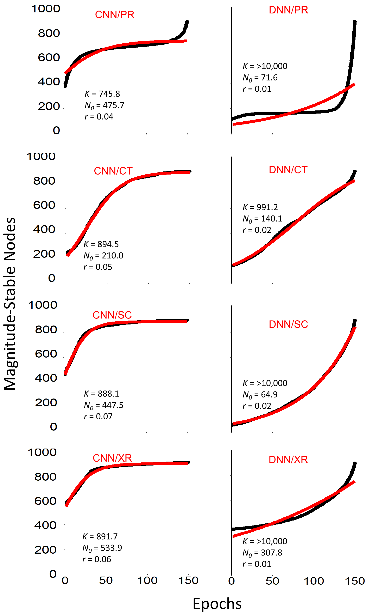

# Neural Network Model Simplification
An alternate approach to simplifying neural network models
---
## Summary

The increasing complexity of artificial intelligence models has given rise to extensive work toward understanding the inner workings of neural networks. Much of that work, however, has focused on manipulating input data feeding the network to assess their effects on network output or pruning model components after the often-extensive time-consuming training. It is shown in this repository that model simplification can benefit from investigating the network node, the most fundamental unit of neural networks, during training. Whereas studies on simplification of model structure have mostly required repeated model training, assessing evolving trends in node weights toward model stabilization may circumvent that requirement. Node magnitude stability, defined as the number of epochs where node weights retained their magnitude within a tolerance value, was the central construct used herein. To test evolving trends, a manipulated, a contrived, and two life science data sets were used. Data sets were run on convolutional and deep neural network models. Findings indicated that neural network progress toward stability differed by model, where CNNs tended to add influential nodes early during training. The magnitude stability approach of this study showed superior time efficiencies, which may assist in XAI research toward producing more transparent models and clear outcomes to technical and non-technical audiences. 

---
## Introduction and Problem Statement

The increasing accumulation of data today is leading us into a future where artificial intelligence (AI) is becoming ever more central. Driver-less cars, robots expressing emotions, real-time language translation, virtual teachers, and diagnoses in healthcare are examples where AI excels. The outlook of AI on our everyday life is short of revolutionizing. The benefits brought to society by AI, unfortunately, do not come without hindrances. One consequence of the increasing complexity of AI models, of which neural networks are one of the most common flavors, is lack of understanding of their inner workings, especially on how the information from input data is used in producing model outcomes. One cause of such obscurity is that neural networks are increasingly becoming overparameterized, which hinders their understanding. Better understanding of how models use information may lead to insights into human learning or uncover new knowledge in science. Knowledge of the inner workings of neural network models may be advanced if a bottom-up, neuron-focused approach is undertaken, as the ultimate construct determining network outcomes is the neuron. Understanding the neuronal patterns as a function of input may better assist in defining what neural networks learn and how. Knowledge of the relational link between model input and output may help in constructing simpler models, assisting in fine tuning hyperparameters, or in creating more efficient and safer algorithms, all in the interest of the continued improvements in the understanding of AI systems. Such understanding, however, is contingent on model complexity. Models of simpler structure, with fewer parameters, are more tractable, thus more transparent, than their full-parameter counterparts. The challenge in reducing structural complexity is centered on which components from models to eliminate without compromising predictive power or unduly adding time to model training.

This repository offers an approach on how simplification in the structure of neural network models can be accomplished in a time-efficient manner, without incurring the time costs from repeated training during model pruning tasks with different sparsity parameters. Because the time effort associated with model training will only increase  as models become more complex, a means to simplify such models while selecting sparsity parameters without requiring model retraining may not only eliminate or diminish time constraints, but also more significantly simplify model structure upon training completion. To that effect, this  study  proposes  the  use  of  a  construct  to find influential model nodes with the objective of simplifying model structure in a time-effective fashion without compromising model predictive ability. Node magnitude stability was the central construct to realize the objective of this study. Magnitude stability was defined as the number of epochs where node weight values retained their magnitude within a tolerance from that of the stable, trained model, defined in this study as models with predictive accuracy over 0.90.

To achieve the goal of this project, the next section will cover experiments and describe the comparison method central to this repository and a popular model simplification approach. The section following is reserved for findings and the last one will bring together this project by discussing the relevance of its findings.

---
## Methods and Experiments

Experiments were done to assess randomness of magnitude stability in neural networks. If the process of magnitude-stable node accretion is completely random, independent of models and input data, there is little point in attempting to understand networks in an effort to produce time-effective pruning mechanisms (Figure 1). Magnitude stability as defined below relies on stable nodes holding their position throughout training. Which nodes become stable may be completely random, determined somewhere during training, but once fixed, a node value should not vary widely, going from significant to unimportant in determining model outcome. Moreover, accretion of magnitude stability must be a function of input data because data properties, such as their size or within-class variance, are what determine model predictive performance. What is less clear is the influence of model choice on the accretion of magnitude-stable node positions during training. What can also be of value is the relative importance of input data and model in determining magnitude stability. One may not have a choice as to data quality, but choosing models is less of an impediment.

Fig. 1. Underlying justification for magnitude stability approach to neural network model pruning.

Analyses in this study were based on the construct of node magnitude stability, herein defined as the number of epochs where node weight values of within a layer retained their value from that of the stable model within a given tolerance. More formally, node magnitude stability is defined as

lim |Wijk,t − Wijk,t−1| ≤ ϵ

where W = weight, i = row, j = column, k = depth (color channel), t = epoch, and ϵ = tolerance.

To determine magnitude stability, all nodes from a model layer at each epoch are sorted by their weight absolute value. The sorted nodes of the last epoch are used as reference. The position of reference nodes is noted and followed backward to the first epoch. The number of consecutive epochs from the reference nodes where node weights in the same position retain a value within a tolerance is defined as the magnitude stability for that node position.

To assess the underlying mechanism that governs model pruning using the con- struct of magnitude stability may be assisted by a formulation of the process through training time describing accretion of magnitude-stable node positions. It is postulated that the accretion will start slow due to the randomness or quasi-randomness of model weight initial conditions. As training progresses the most influential nodes for model prediction are fixed early, followed by less influential nodes late during training. The process herein proposed for describing node accretion depicts cases ranging from few influential nodes at one extreme to a large number of nodes contributing to model predictive abilities (Figure 2).

Fig. 2. Theoretical relationship between the mean number of magnitude-stable nodes and training epoch.

The functional relationship above may best be described by a biological growth curve, commonly used in theoretical population ecology. That relationship takes the form

Nt = K / [1 + (K−N0/N0) e−rt]

where t is as above, and Nt is the number of magnitude-stable nodes at epoch t, K = maximum number of magnitude-stable nodes, N0 = number of stable nodes at the first epoch, and r = the rate of magnitude-stable node accretion during model training.

The growth relationship is able to capture both accretion rate extremes above for number of influential nodes determining model predictive power. Moreover, due to its closed form, it may be readily solved after each epoch and used in conjunction with algorithms for model training to estimate the rate of magnitude stability accretion for deciding on possible early stopping of training or pruning less significant nodes.
Early stopping, a compromise approach between training time and model accuracy, has been used in response to the need of improved time-efficiencies in gradient boosting, natural language process, and facial recognition applications by means of feature extraction, manipulations of learning rates, or token skipping. Using the approach proposed in this study in conjunction with existing early stopping methods might result in improved training efficiencies due to elimination of non-influential nodes while training.

### Experiments
#### Data Sets
A processed, contrived, and two data sets from life science were used in this study’s experiments and a popular, unmodified data set for the simplification approach demon- stration. The processed data set (PR) was a reduced version of the MNIST handwritten data set. One-hundred images per category were randomly selected from the MNIST data set to keep accuracies from reaching high values early during training. Avoid-  ance of high early accuracy was to enable investigation of patterns in weight value progression during training, as per experiments below. The first life science data set (SC) was of Gulf menhaden (Brevoortia patronus) scale black-and-white images, used in estimation of fish age. Classes for this data set were 0-4, the possible observed ages for the target fish. The number of images within each class was 530, of 100 by 100 pixels each. The second life science data set (XR) was of pneumonia x-ray images.  This latter data set was of 500 100 by 100 pixel grayscale images, with a category for pneumonia presence and one for absence.
The contrived data set (CT) was generated to have better control and understand- ing of model output, especially the number of epochs before stabilization. Having better control of model output might enable finer and more accurate study findings and interpretation. The contrived data set comprised of grayscale images with 10 shades of gray, producing 10 classes, which formed the inputs to neural network models. The classes for this data set were generated by sampling from a Gaussian distribution with means of 20, 50, 75, 100, 125, 150, 175, 200, 225, and 240 to mimic pixel depth for grayscale images. The means selected for classes were chosen to ensure an even spread of shades of gray among classes. The standard deviation was 1,000 across all classes, which allowed model convergence within an adequate number of epochs. Data points that were below zero or above 255, the range for grayscale image shades of gray, were forced to take the minimum or maximum value, respectively, of that range. The number of generated images within each class was 50, each of size 100 by 100 pixels. A demonstration of the effectiveness of this study’s approach to simplification was conducted to show how the findings of this study can be applied to further research in XAI by providing an alternative method to achieve simpler, more interpretable, neural network models. The demonstration was based on the full MNIST data set. The full MNIST data set was used in the interest of research reproducibility and because of its frequent use in research, enabling more ready comparisons with existing research studies in XAI and model simplification.
 
#### Models and Runs
To address randomness in magnitude stability, experiments were conducted to inves- tigate patterns in the progression during training of node weights according to AI models, data sets, and epochs. Epochs were used as the time surrogate in assessing training weight progression. The models tested were deep neural networks (DNN) and convolutional neural networks. The DNN model architecture consisted of a flattened input layer, six fully connected layers of 30 x 30 nodes, and the output softmax layer. The CNN model comprised of an input, a fully connected, and an output set of layers. The fully connected and output layers were as in the DNN model. The CNN input   layer consisted of a sequence of three convolution layer (3 x 3 kernel) and max pooling layers, followed by another convolution layer, and ending with a flattened layer. The flattened CNN layer served as the input to the fully connected layer. To keep compar- isons consistent, a ReLU activation function, Adam optimizer, He-Normal initializers, batch size of 32, and the learning rate of 0.001 were used throughout.
Images in the data sets above were fed one at a time into the input layer of the  above models. Images were flattened and padded to keep size consistence prior to model input. Padding was done by addition of extra pixels of value 0, mimicking an empty,  black background. Each image pixel corresponded to a node in the input layer  to the model tested.

Both, DNN and CNN models were run toward stabilization on the four data sets above in replicates of 50. Each replicate was run for 150 epochs. Model runs that did not converge to at least 0.90 percent accuracy were re-run for inclusion in analysis. After each epoch, the current model accuracy and the node weights from the layer before that for the softmax activation were extracted for node pattern analysis (focus layer henceforth). Node analysis consisted of an assessment of whether the progression of node weights from the initial run to stabilization could be predicted as to the stability of their value, potentially identifying the most significant nodes in determining model accuracy early in the training process.

#### Data Analysis
To investigate magnitude stability, a visualization approach was developed for the focus layer according to the above experiment. A biological growth curve was fit to and associated parameters shown for the magnitude stability data as an aid for visualizing the shape of the relationship between epoch and magnitude stability. A growth curve was fit for each combination of the models and data sets discussed above for a better understanding of the differences in growth characteristics according to those factors.

Statistical analyses in this work to assess randomness were based on the construct  of node magnitude stability, defined and determined as above. To test for neural  network node patterns in weight evolution through time, the statistical significance of magnitude stability was assessed. The tolerance for node magnitude stability was taken to be five percent. Only nodes from the focus layer were tested. Stability patterns were assessed with a generalized linear model (GLM) using magnitude stability as the response variable with a quasi-Poisson link function. The predictors for the GLM were the model type, of levels DNN or CNN, and the data sets, of levels CT, PR, SC, and XR. The Tukey’s Honest Significance post-hoc GLM was used to infer within-mean differences for statistically significant factors.

An additional test was performed for assessing the relationship between the number of stable nodes and training time. The relationship was tested in two steps. The first step consisted of using a linear regression to estimate the slope of the relationship between epochs, the independent variable surrogate for training time, and the number of stable nodes in the focus layer for each replicate as above. Stable nodes were defined as nodes that were magnitude-stable at a given epoch, i.e., nodes that retained their value within the above tolerance from that of the last epoch. For each epoch, stable nodes were counted and used as the response variable in the regression analysis. The response variable was logarithm-transformed prior to estimating regression parameters to ensure assumption meeting of homoscedasticity. The second step in analyzing node progression was to examine the slopes of the regression analysis obtained in the first step. An analysis of variance (ANOVA) using as factors model and data set, and the regression slopes as the response variable was conducted.

#### Comparison of Methods
Comparison of model simplification approaches were done contrasting the exponential decay (ED) method, one of the most popular and efficient, against the node magnitude stability approach proposed in this study. For magnitude stability, tolerance values of 0.01, 0.03, 0.05 were used in comparisons. The ED method con- sists of removing neural network nodes by identifying node weights that gradually decay to zero, instead of the more common pruning alternative of removing nodes of weights below a given threshold. A gradual, smooth decay tends to preserve trained information in nodes.

Node magnitude stability was determined by extracting the weights of the focus layer for each epoch from the trained model. Stability value was calculated by first sort- ing the weights from each epoch. Second, starting from the last epoch, counting nodes that retained their value within the specified magnitude tolerance was done. Finally,  nodes to eliminate were selected from the focus layer. Node elimination was done by choosing a stability value  (surrogate for sparsity) within the number of epochs used     to train the model. Nodes of magnitude stability smaller than the chosen value were eliminated (assigned zero weight value). Note that choice of stability value subsequent from the first does not require model retraining.

Method comparisons were done using elimination of nodes from the focus layer. For the ED method, nodes were eliminated until a threshold sparsity was achieved. Sparsity threshold values ranging from zero, no nodes eliminated, to 100 percent were examined. After each threshold choice, model retraining was required for re-estimation of accuracy. Alternatively, when testing for magnitude stability, their stability values as defined above were used as a surrogate threshold for sparsity. Magnitude stabilities ranging from one to the maximum possible value, the number of epochs, were used. Models for the demonstration of this study were of the same structure and trained using identical parameters as above, except for epochs. Epochs for testing the ED model were only three, the minimum to achieve model convergence. To allow for magnitude stability to reach values for adequate comparisons, 100 epochs were used  for testing the method proposed herein.

Five model runs for CNN and five for DNN were conducted for replication. Model predictive accuracy, number of nodes with non-zero weights, and time to pruning were recorded for both methods tested.

## Findings

The visualization approach conducted as above showed that the number of stable nodes at the focus layer as a function of epoch tended to tightly fit a biological growth function (Figure 1). All runs for the CNN models showed a weak early growth with a rapid growth toward the end. The timing of the accelerated growth for CNN models was different for the data sets tested, with the CT starting at the earliest. The runs  on the PR data set generally followed a biological growth curve covering an entire life of an organism or population, in that it grew fast early and levelled off at later epochs. For the remaining data sets, the growth curve shape was more characteristic of a population unconstrained by resources, where growth tends to be exponential. Additionally, runs on the CT, SC, and XR data sets showed unrealistically high values for the theoretical maximum number of magnitude-stable nodes, characteristic of a population with unlimited resources (Figure 3).

All experimental runs for testing magnitude stability randomness reached stability after 150 epochs, many of which achieved accuracies well above 0.90. Exceptions worth mentioning were models run on the CT data set. For CNN models, an additional 42 runs and for DNN models, an additional 6 runs had to be conducted to reach 50 replicates for that data set.

Magnitude stability averages within model and data set were always highest for CNN models. Also, stability values for CNN models tended to be more consistent, as indicated by the smaller standard deviations. Average magnitude stability for factor model over all data sets was 133.7 ± 32.20 standard deviations (SD) for level CNN and 78.1 ± 53.46 SD for level DNN. For factor data, average magnitude stability over
all models was 71.8 ± 61.57 SD for level PR, 121.8 ± 35.90 SD for level CT, 118.3 ± 41.76 SD for level SC, and 111.8 ± 49.59 SD for level XR. The lowest magnitude stability for the CNN model was observed for the PR data set. The other data sets for that model were of similar magnitude stability. Magnitude stabilities for data sets run on the DNN models were more variable, perhaps an indication of sudden additions of magnitude-stable nodes during training. The higher standard deviations for the data sets run on the DNN model are also an indication that magnitude-stable nodes were added at irregular times during training.

The GLM results showed factors model (p 0.01, F-value = 587,949), and data set (p 0.01, F-value = 3,908) to be highly significant predictors, indicating that magnitude stability was dependent on those factors. The model factor had the highest influence on the GLM results (as per F-values), indicating it had a stronger effect on the response variable than did the factor data set. This is encouraging results because models, unlike data sets, can be adjusted and modified toward successful pruning based on the concept of magnitude stability. Post-hoc analysis also indicated highly significant differences in mean magnitude stability among all the data  sets.
The results following ANOVA analysis on the slope of the regression of epochs on the logarithm of magnitude-stable node counts also showed high significance for the factors model and data set. As per the F-value, the factor model (p	0.01, F-value = 110.7) was more influential in determining the slope than was the factor data set (p 0.01, F-value = 15.6), a parallel result from the GLM analysis for the higher influence of models over that of input data. The factor model, therefore, was the most important in defining the rate of addition with epoch of magnitude-stable nodes. The benefit of this finding is as above reported for the GLM analysis. Post-hoc analysis for the ANOVA indicated statistical significance for mean magnitude stability differences between the XR and CT, XR and PR, and XR and SC data sets, with only a marginal significance between the SC and PR data set.
 

Fig. 3. Relationship between the mean number of mangitude-stable nodes in the focus layer across replicates and epoch; red line is the fit to the growth function, black dots are the observed data; PR: processed, CT: contrived, SC: scale, XR: x-ray data sets.

Comparisons of model simplification approaches consistently showed over one order magnitude larger time efficiencies for magnitude stability than the ED model sim- plification method. Both methods showed similar accuracies roughly until 25 to 30 percent sparsity values. The magnitude stability method tended to decay in accuracy more gradually. Higher tolerance values for magnitude stability tended to hold higher accuracies for longer (Figure 4).

Fig. 4. Comparison of model simplification methods; ED is exponential decay, MS is magnitude stability; values are mean algorithm run times ± standard deviations between sparsity values; 0.01, 0.03, and 0.05 are tolerances used for magnitude stability model simplification runs.

---
## Concluding Remarks

In general, this project suggested that the progression toward model stabilization using magnitude stability as a metric was not linear. The evidence for an exponential relationship between magnitude stability and epoch was particularly appealing for DNN models, where value stability started low and grew fast toward the end of training, without plateauing afterward. Conversely, for CNN models, the fit to the logistic growth curve indicated that addition of stable nodes leveled off after some point during training. Particularly for CNN models, using the findings of this study to lower training time through tasks such as pruning may be attempted with success. Training may stop when reaching the plateau, saving training time, along with simplifying the model by eliminating non-stable nodes. Regardless of findings, however, this study points to the possibility of making training more efficient and models more transparent. Expanding on this study’s findings, therefore, may only further add to the potential benefits of this work.

This repository’s experiments show that randomness does not dominate neural network learning. To capitalize on this, the concept of magnitude stability for model structure simplification was offered. Additional work in line with this project’s approach might be investigations on spatial patterns according to magnitude stability values. Examining if a spatial structure exists when viewing a layer as a 2- or 3-D array may assist in  better understanding how the network represents input data. More on further studies,  the results of this study apply only to the last layer before the softmax of CNN and DNN models. Assessing other layers might provide a better picture of how a network can be further simplified. Adding additional layers from the fully connected layers of CNN and DNN models might be challenging because of the complex dependencies of weights from different layers. A weight from a given layer is dependent on the weights of all previous layers, making selection on which weights to eliminate from previous layers a challenge. Future work extending the results of this study, such as multilayer model simplification using magnitude stability, may not only offer better, more effective models, but also, possibly more importantly, aid in closing the gap between model complexity and understanding, hopefully matching the speed in model advances with how fast we manage to understand their inner workings.

